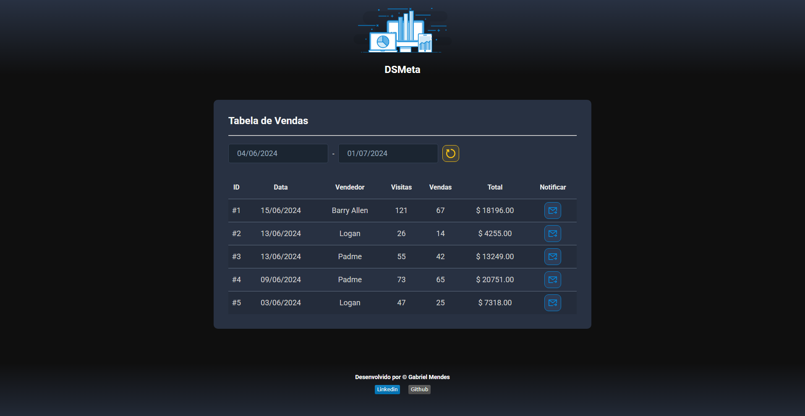
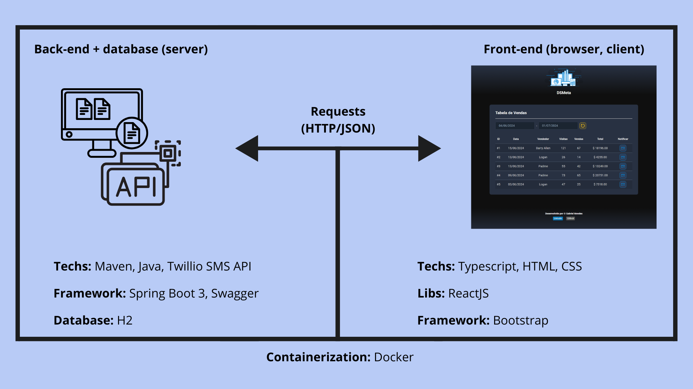

<div align="center">

### **DSMeta** 🖥️

App de listagem de vendas Multiplataforma com as tecnologias mais demandadas do mercado, como: _**Java, Spring, ReactJS, Docker and Twilio SMS API.**_



</div>

> ##### Acesse o deploy da aplicação [clicando aqui 🖥️](https://github.com/Biellms)

#

<div align="center">

#### **Sobre** 📝

</div>

DSMeta é uma aplicação full-stack web e mobile desenvolvida durante a aulas da **Semana Spring React**, evento organizado pela **[DevSuperior](https://devsuperior.com.br)**.

- **[Back-end](https://github.com/Biellms/DSMeta/tree/main/backend)** construido como projeto **Maven** com **Java 17** e **Spring Boot 3**. Com a utilização e consumo do **Twilio SMS API** para envio de mensagens personalizadas para numero de celulares. 

- **[Front-end](https://github.com/Biellms/DSMeta/tree/main/frontend)** construido em **ReactJS** com template em **Typescript**. E a estilização com o **framework bootstrap**.

<div align="center">

#### **Escopo do projeto** ⚙️



</div>

<br>

**Try yourself with [docker](https://www.docker.com/products/docker-desktop/):**

1. Clone o projeto em https no seu ambiente de trabalho:

```bash
git clone https://github.com/Biellms/DSMeta.git
```

<br>

2. Acesse o repositório e crie um arquivo `.env` para as variaveis de ambiente na pasta `/backend`, com as suas seguintes informações do **[Twillio](https://www.twilio.com/docs/messaging)**:

```text
TWILIO_SID=?
TWILIO_KEY=?
TWILIO_PHONE_FROM=?
TWILIO_PHONE_TO=?
```

<br>

3. Acesse o repositório `/DSMeta` e execute o arquivo `docker-compose.yml`:

```bash
docker-compose up
```

<br>

4. Acesse o `http://localhost:5173` no seu navegador.

<br>

#

<div align="center">

**Developed by © Gabriel Mendes**

<a href="https://www.linkedin.com/in/gabriel-mendes-0706ab1b8" target="_blank"></a> <a href="https://github.com/Biellms" target="_blank"></a>

</div>
