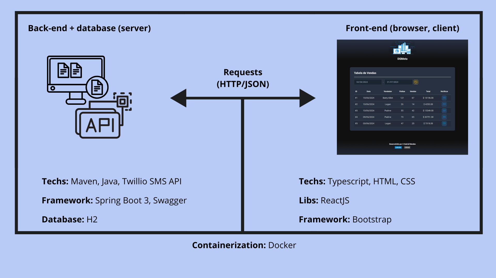

### **DSMeta** 🖥️

App de listagem de vendas Multiplataforma com as tecnologias mais demandadas do mercado, como: _**Java, Spring, ReactJS, Docker and Twilio SMS API.**_

> ##### Acesse o deploy da aplicação [clicando aqui 🖥️](https://github.com/Biellms)

#

### **Sobre** 📝

DSMeta é uma aplicação full-stack web e mobile desenvolvida durante a aulas da **Semana Spring React**, evento organizado pela **[DevSuperior](https://devsuperior.com.br)**.

- **[Back-end](https://github.com/Biellms/DSMeta/tree/main/backend)** construido como projeto **Maven** com **Java 17** e **Spring Boot 3**. Com a utilização e consumo do **Twilio SMS API** para envio de mensagens personalizadas para numero de celulares. 

- **[Front-end](https://github.com/Biellms/DSMeta/tree/main/frontend)** construido em **ReactJS** com template em **Typescript**. E a estilização com o **framework bootstrap**.

### **Escopo do projeto** ⚙️

 

#

**Developed by © Gabriel Mendes**

 

